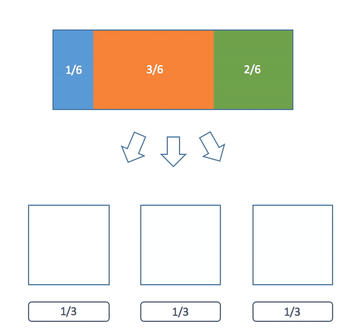

Title: The Alias Method for Fast Weighted Random
Date: 2017-06-25
Modified: 2019-10-15
Category: algorithms
Tags: probability, algorithms
Slug: alias-method
Authors: Peter Stefek
Summary: Constant time draws from a discrete distribution.

<style>
thick.thicker {
    font-weight: 900;
}
</style>

**<text class = "thick">Lets say you have a bag with 2 orange marbles, 2 blue marbles and 2 green marbles</text>.** You draw one marble out of the bag. The probability of drawing any color marble is 1/3. This is called a uniform discrete distribution. It's easy to draw from this distribution with a computer. Computers can generate uniform pseudo random numbers in constant time so all you would have to do is generate a number from 1 to 3 and map it to a color of marble depending on the result. This can be done in constant time for any arbitrary number of colors as long as there are the same number of each color of marble.  
<br>
**But now let's try a slightly different problem.** Let's take a bag with 1 orange marble, 2 blue marbles and 4 green marbles. This distribution is a general discrete distribution. Clearly we can't tackle this exactly the same way as before. One simple adjustment we could make is to generate a random number between 1 and 7 and map it to 7 boxes. We could put a marble in each box and assign a orange marble to one box, blue marbles to two boxes and green marbles to four boxes. We then lookup the box which corresponds to the number we generate and check which kind of marble it has. This generates the correct distribution.  
<br>
**Finally now let's look at a different general discrete distribution.** For example, the distribution of orange, blue and green marbles with weights: p(orange) = 251/1000, p(blue) = 479/1000 and p(green) = 270/1000. We cannot use the first technique because there is no easy way to simplify these numbers. The second technique would require us to create 1000 boxes, so it also seems pretty bad. The weakness of our second technique is that the setup time depends on the weights, so the messier the numbers are the longer (and more space) it takes. This is not ideal.   
<br>
**Now we can talk about a simple algorithm which solves our problem.** The plan is to partition the interval [0,1] into n different parts based on the probabilities of each event. In our above example we could partition the interval into three sections with sizes orange = 0.251, blue = 0.479 and green = 0.27. Below is an O(n) algorithm to do this.
```python
import random

def weightedRandom(weights):
	"""
	Draw from a general discrete distribution.
	:param weights: A dictionary of weights which sum to one.
	:return: A random sample from it the distribution defined by the weights.
	"""

	#generate a uniform random number from 0 - 1
	remainder = random.random() 

	for weight in weights.iteritems():
		value, color = weight
		remainder -= value
		if remainder <= 0:
			return color

weights = {3.0/6.0 : "orange", 1.0/6.0 : "blue", 2.0/6.0 : "green"}

counts = {"orange" : 0, "blue" : 0, "green" : 0}
for i in xrange(600000):
	counts[weightedRandom(weights)] += 1

print counts
```
<br>
**So can we do better?** The answer is sort of. It depends on what we want to do. It turns out if we want to sample from the same distribution multiple times, then we can. We will do just one preprocessing step (which will be the same time/space complexity for any set of n weights) and after that each sample will be O(1). So the more times we want to sample from the same distribution, the better the performance will be.  
<br>
**How does this work?**
I'm going to go over the preprocessing step in a later section but first I'm going to describe how we do the O(1) lookups. Consider a general discrete probability distribution with n weights. We are going to divide it up into n boxes such that each box will contain pieces of either one or two different different weights and the pieces of these weights will sum to 1/n. From our definition the sum of all the pieces of all the weights in the boxes is 1 (the size of the entire distribution).  
<br>
**The description can be difficult.** I think a picture can really help. In this example we have three colored balls with weights p(blue) = 1/6, p(orange) = 3/6, p(green) = 2/6:
<p align="center">
	 
</p>
**Once we have this partitioning, our algorithm is very simple:**   
First we pick one of the 3 boxes. Then we choose a uniform random number between 0 and 1. We see which side of our chosen box it falls on and we return that color marble.  
<br>
**Now we need to find these partitions.** First of you might be asking yourself, why can we always partition the distribution like this? To answer that we will first provide an algorithm to construct these partitions then prove it always works.  
<br>
**The basic idea of this algorithm is about filling up these boxes.** First a quick observation. If we look at all the weights in a normalized (the sum of all the weights is one) probability distribution at least one of them must be less than or equal to 1/n where n is the total number of weights. Why is this important? This means that we can always fit one of these weights into a box of size 1/n possibly with some left over space.  
<br>
**Our partitioning algorithm is as follows:**  
1) Sort the weights from least to greatest.  
2) Choose the smallest weight and put it into a box. Then if there is any space left over, fill in the extra room with some of the largest weight.  
3) Repeat steps 1 and 2 until all of the boxes have been filled.  
Here's a visualization of the algorithm:
<p align="center">
	 
</p>
**Now why can we always do this?** Now that we have the algorithm we can use induction to give a formal proof. Our claim is a little more general than what we have been saying earlier but it will make the proof easier.  
<br>
**Claim:** Given a set of n non-zero real numbers (called weights) we can partition them into n boxes of size s/n (where s is the sum of all n weights) such that each box only contains pieces of at most 2 weights using our algorithm.  
<br>
**For the base case:** Clearly if we have just one weight we can just put it in a single box by itself.  
<br>
**Now comes our inductive step:** Suppose that we know our claim is true for n - 1 weights. Now we must show it is true for n weights.  
<br>
**Let's do the first step of our algorithm:** We put the smallest weight in a box of size s/n. We know that it must fit because if it did not our weights would sum to more than s. Now if there is any left over space we fill it with some of our largest weight (by similar logic to the previous sentence this is also always possible). Finally we are left with one filled box and n - 1 unfilled boxes. We know by the inductive hypothesis (our assumption) that we can split whatever is remaining into those n - 1 boxes. Therefore we are done.  
<br>
**Now finally what is the running time of the preprocessing step?** First we need to sort all the weights which is O(nlog n). Now we need to do n steps where we get rid of the smallest weight and restart. However the key here is that only the largest weight needs to considered for sorting because its the only value let in the partition that is changed besides the one removed. We can do this in log n time with a binary search (because we have already sorted our weights). Therefore the rest of the algorithm is also O(n log n) so the whole algorithm is O(n log n).  
<br>
**Here is an implementation of our algorithm:**  
<br>
```python
import numpy as np
from bintrees import AVLTree
import random

def partitionWeights(weights):
	"""
	The preprocessing step.
	:param weights: A dictionary of weights which sum to one.
	:return: A partition used to draw quickly from the distribution
	"""
	epsilon = 0.00001 # for floating point precision issues
	boxes = []
	numWeights = len(weights)
	# We use a AVLTree to make our pull/push operations O(log n)
	tree = AVLTree(weights)
	for i in xrange(numWeights):
		smallestValue, smallestColor = tree.pop_min() # O(log n)
		overfill = 1.0 / numWeights - smallestValue
		if overfill > epsilon:
			largestValue, largestColor = tree.pop_max() # O(log n)
			largestValue -= overfill
			if largestValue > epsilon:
				tree.insert(largestValue, largestColor) # O(log n)
			boxes.append((smallestValue, smallestColor, largestColor))
		else:
			boxes.append((smallestValue, smallestColor, "none"))
	return boxes

def drawFromPartition(partition):
	"""
	The draw step.
	:param partition: partition A partition of a distribution into boxes.
	:return: A sample from the distribution represented by the partition.
	"""
	numBoxes = len(partition)
	i = random.randint(0, numBoxes - 1)
	value, color1, color2 = partition[i]
	if random.random() / numBoxes <= value:
		return color1
	else:
		return color2

weights = {3.0/6.0 : "orange", 1.0/6.0 : "blue", 2.0/6.0 : "green"}

partition = partitionWeights(weights)

counts = {"orange" : 0, "blue" : 0, "green" : 0}
for i in xrange(600000):
	counts[drawFromPartition(partition)] += 1

print counts
```
**One final note on runtime.** If you run our example code you'll notice the "slow" function is almost twice as fast as the "fast" one. Have I been lying this whole time? No. This is because in our example we used a small number of weights. In a [separate speed test](https://gist.github.com/Mr4k/eabaca318499bd54e5e18431efbc6622) I use 1000 weights and draw from the distributions 100000 times each. In this case the fast algorithm runs in 0.35 seconds on my computer while the slow algorithm takes about 15 seconds.
