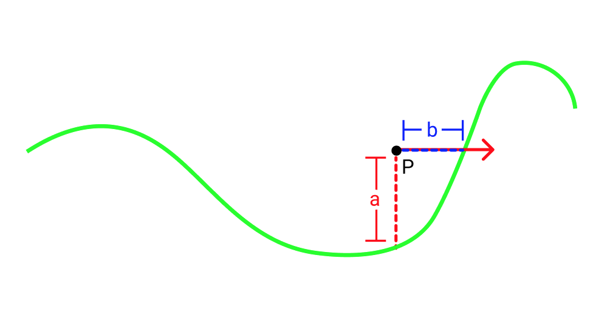
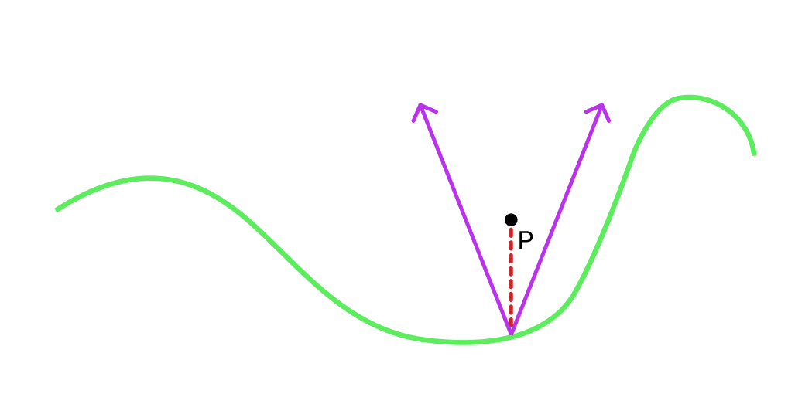
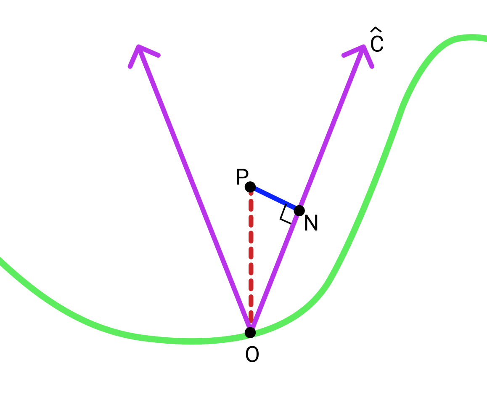

Title: A Note on Ray Marching with Heightfields
Date: 2019-10-18
Modified: 2019-10-18
Category: graphics
Tags: raymarching, graphics
Slug: ray-marching-heightfields
Authors: Peter Stefek
Summary: Short stepping to avoid collisions

$\newcommand{\norm}[1]{\lvert \lvert #1 \rvert \rvert}$
 
Ray marching is a technique for testing ray intersections with a scene.
If you are new to ray marching, I highly recommend reading one of these [great](https://www.iquilezles.org/www/articles/raymarchingdf/raymarchingdf.htm) [introductions](http://jamie-wong.com/2016/07/15/ray-marching-signed-distance-functions/)
to the technique.
The central idea in raymarching is that the scene is represented by a distance field function $D(pos)$
which gives the distance to the closest surface at each point. This distance field function for a scene is usually built by combining the distance fields of many primitives such as spheres, cubes and planes. Usually the distance field of each primitive can be analytically defined. A simple example of one of these primitives is a sphere at the origin
with radius r whose distance field function is defined as follows in glsl:
```
function distSphere(vec3 pos, float r) {
    return mag(pos) - r;
}
```
On thing you might notice here is that if you are inside the sphere the distance field is negative. This is called a signed distance field. While we don't use the signed part in this article you can find more information about them [here](https://www.iquilezles.org/www/articles/distfunctions/distfunctions.htm). <br><br>
People often tend to use heightfields as primitives in raymarching. A heightfield is
a function `h(vec2 pos)` that takes a 2d coordinate and returns the height
at that point. They can be thought of as topographical maps. Heightfields are useful because they allow artists to easily define bumpy surfaces such as waves or terrain. 
Common analytic heightfields include simplex noise, and sin / cosine waves.
Typically people use a function like the one below for the heightfield's distance field function:  
```
function distHeightfield(vec3 pos) {
    return h(pos.xz) + pos.y;
}
```
where `h(vec2 pos)` is the heightfield function. However this function is really not a distance field. To see why we can look at the image below.  
  
Let's say we are at point P and we shoot a ray to the right (represented by the red ray in the picture). If we use our `distHeightfield` function we will think that the closest surface is $a$ away. However in the direction our red ray is going, the closest point is really $b$ away which is smaller than $a$. So if we took a step of size $a$ along the red ray we would overshoot the heightfield. <br/><br/>
One way to solve this problem is to use a smaller step size. In fact it turns out we can just 
down scale our step size by a constant multiple. So instead of taking a step of size `D(pos)` as 
usual we could take a step of size `D(pos)*shrinkFactor`. One way to find the shrink factor is to just try plugging in small constants 
until we get good results. In practice, there is absolutely nothing wrong with this approach. But if we want we can apply a more principled approach to finding a shrink factor.  <br/><br/>
**Obtaining a shrink factor**:  
Let's start by just trying to obtain a safe distance which gives us a lower bound on how far we can go in any direction without hitting anything. A really simple
way to do that is by creating a surface that will always be between our point P and the heightfield and finding the closest distance to that surface.  
A cone (more of a v shape in 2d) whose bottom starts on the heightfield directly under P is a good choice. Here is a picture:  
  
Now we need is to chose a slope `c` for the sides of the cone such that the it's edges will always lie between the heighfield and our point. If our heighfield function
is continuous and its derivative is bounded everywhere it is defined then `c` could be the lowest upper bound on the absolute value of the derivative.  <br/><br/>
Finally we have to find the closest distance from P to the edges of the cone. This distance will be our conservative bound.  <br/><br/>
Note while the math below is in 2d, the 3d case is basically identical:  
  
Let $O$ be the bottom of the cone and $N$ be the closest point on one of the edges of the cone to $P$. For consistency we will choose the right edge although it doesn't matter.  
First define $\hat{C}$ as the normalized vector pointing from $O$ along the right edge of the cone.  
$\norm{\overrightarrow{ON}}$ is given by $\overrightarrow{OP}\cdot \hat{C}$.  
Given that $\overrightarrow{OP} = (0, h(P))$ we can say, $\norm{\overrightarrow{ON}} = \frac{h(P)c}{\sqrt{1+c^2}}$.  
Finally using the pythagorean theorem we can find $\norm{\overrightarrow{PN}} = \norm{\overrightarrow{OP} } - \norm{\overrightarrow{ON}}$ which is $\frac{1}{\sqrt{c^2+1}}h(p)$. <br> $\norm{\overrightarrow{PN}}$ is our conservative lower bound. This also means we can use $\frac{1}{\sqrt{c^2+1}}$ as our shrink factor.
 